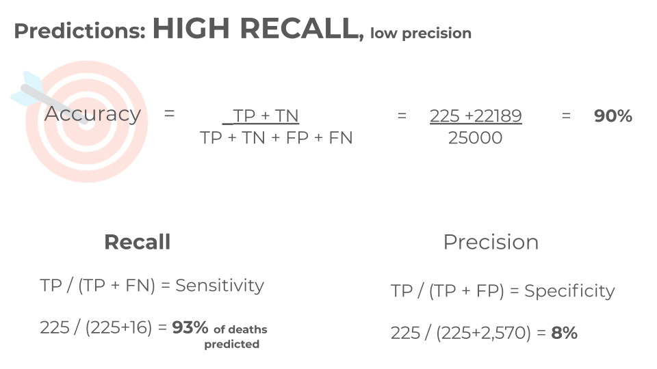

## Problem Statement
As of August 4, 2021, [John Hopkins University](https://coronavirus.jhu.edu/map.html) has reported almost two-hundred million cases of COVID-19, with over four-million deaths worldwide. I used a subset (n=100,000) of randomly sampled cases from a CDC data source (N = 26,887,803). The goal of my model is to predict mortality outcomes of COVID-19 cases in the US dated, Jan 2020 - June 2021.

## Executive Summary
When the COVID-19 pandemic took hold in Spring 2020, I designed a contact tracing system for communities in New Mexico. My understanding of the data collected inspired me to create a tool that could potentially be used to inform treatment and public health planning for someone at CDC, health providers, or other public health entities with access to identifiable COVID-19 case data. 

## Data
  - [CDC COVID-19 Case Surveillance Public Use Data with Geography](https://data.cdc.gov/Case-Surveillance/COVID-19-Case-Surveillance-Public-Use-Data-with-Ge/n8mc-b4w4) 

  - [Data Dictionary](./COVID-19_dict.pdf)

  
## Models

`Classification Approach` 

  - Logistic regression used scaled data (standard scalar)

  - A random forest model was selected, with undersampling of majority class in order to maximize recall and minimize the number of false positives.

 - Undersampling of the majority class was undertaken given the predominance of the majority class (no death recorded = 99% of cases) compared to the minority class (death = 1% of cases)
  

        |       Original           |   Recall   | Precision |  Accuracy  |
        |:------------------------:|:----------:|:---------:|:----------:|
        | Logistic Regression      |    0.15    |    0.42   |    0.99    | 
        | Random Forest Classifier |    0.16    |    0.45   |    0.99    | 

        |       Undersample        |   Recall   | Precision |  Accuracy  |
        |:------------------------:|:----------:|:---------:|:----------:|
        | Logistic Regression      |    0.92    |   0.08    |    0.89    | 
        | Random Forest Classifier |    0.94    |   0.08    |    0.90    | 

            

## Conclusions
- Model is better suited to predict those most likely to die, perhaps to inform treatment options and life decisions, than to predict survival. 

- It has a notable strength, but significant limitions. Data that was missing or suppressed due to privacy protection may have influenced prediction. 

- Next Steps : 

  - Run full CDC dataset (N = 26,887,803) in AWS 
  - Try Knn and Time Series
  - Attempt to maintain high sensitivity, while increasing specificity, perhaps with a data set with less missing and/or suppressed data
